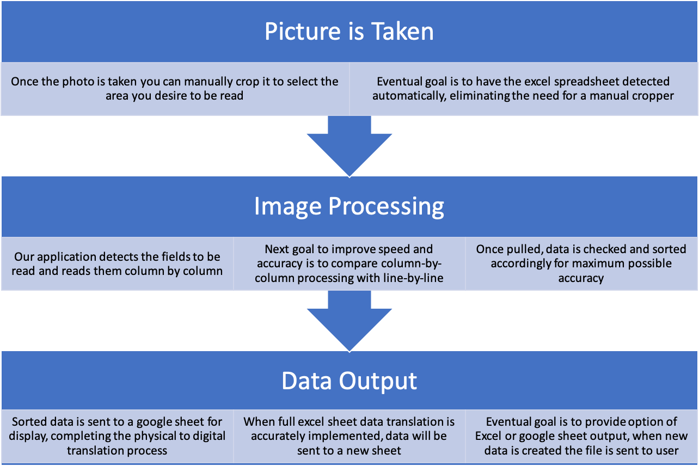
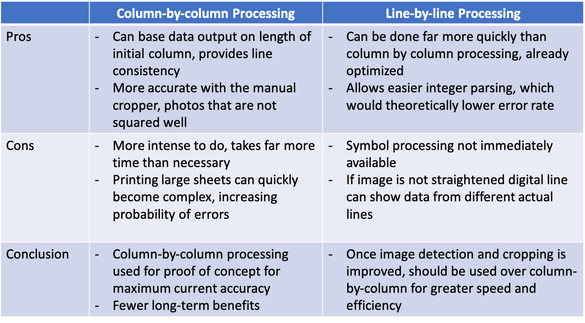

### The Idea 

As the use of technology in the workplace becomes ever more ubiquitous, there are some monotonous aspects of everyday jobs that have been done manually for too long. One such example is the manual transition of data from a physical copy of some data to excel. In many financial services fields, firms are given physical copies of data on meeting clients, acquisition targets, and so on. To evaluate the value of the party/parties on the opposite side of the negotiation table, this data must be transferred into a model of some sort on excel. The goal of our application is to automate this process.

### Goals 

1.  Our initial goal is to show a proof of concept for the application prior to further development. This proof of concept will be reading one section of a picture of a data sheet, recording the data and printing each column out to the console, and sending one of those recorded rows to a google sheet. 

2.  By simply taking a picture of the data you need, 'Auto Analyst' on full initial implementation should able to send you a excel sheet with all the values already filled. That way you can get right to modelling instead of spending a few hours on manually copying all the data. 

3. A 3-Statement Model Module, when selected, will be able to detect two out of the following in the images taken: 
   *  balance sheet 
   *  income statement 
   *  cash flow statement
   
4. Post detection, the app will use the two detected models to create the missing sheet, and then set up the relational equations between each value for future prediction. This is modelling in easy mode. All you have left to do is input your constants. 

Goal 1 is our current scope for the final project, and will be completed by the deadline. 
Goals 2, 3, & 4 of the project are stretch goals, which we aim to achieve but don't think it is fesible before the project deadline. The goal of completion for these (if the project is pursued) is by the end of June. 
Other types of models (waterfall, capex, etc.) may be added on as other modules that could be pursued in the future. 

### Process 

Linear Progression of AutoAnalyst 

### Implementation

Key decision: What direction to proceed in with data processing algorithm

Other Important future considerations include:
- Displaying history of data recordings or transfers locally
- Procuring larger set of test materials, partner with potential clients for development 
- Ensuring secure transfer of data and store nothing on cloud permanently (eliminate any potential liability for NDA agreements regarding translated data) 
- Elimination of dependency on 3rd party API's wherever possible
- Development of proprietary data reading or detection algorithm

### Team 

David Perez Gonzalez - Back End server script, Text recognition and parsing of data 

Callum Hafner Schnee - Firebase implementation, Volley library code, http Post-Request

UI Shared, major emphasis was on operation.  

### Download the APK

[Link to another page](./another-page.html).
